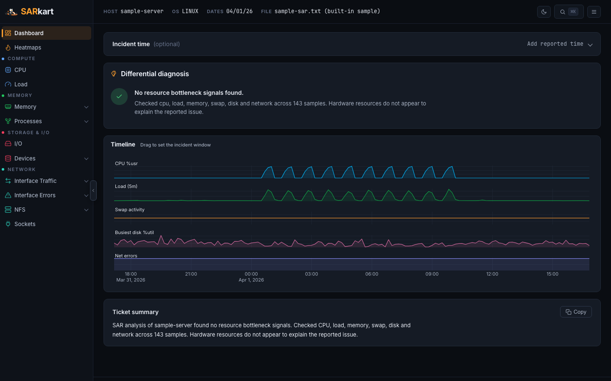
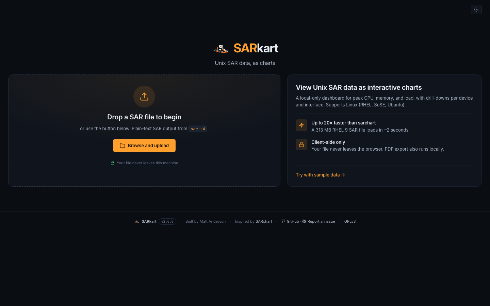
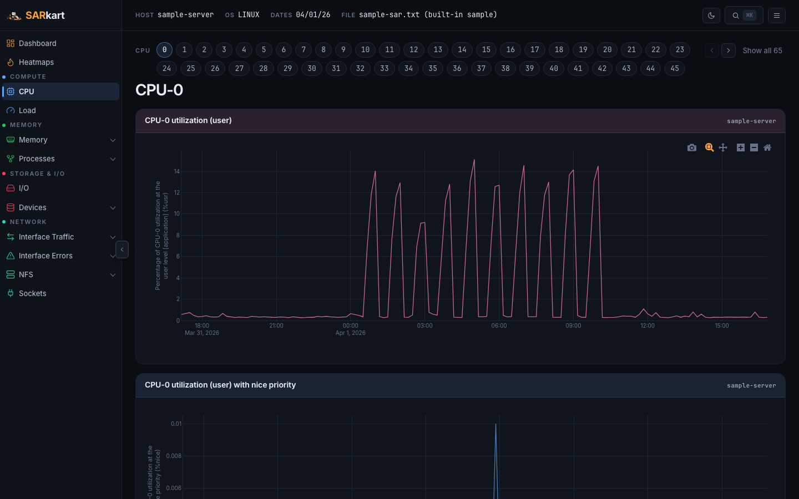
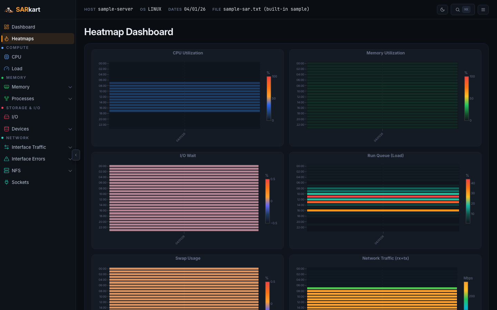

# SARkart

SARkart is a fast, browser-based viewer for Linux and Unix SAR (sysstat) files. Drop in a sar text file and get interactive charts for CPU, memory, disk, network, and load — all rendered locally, no server upload.

**🚀 Try it live: [sarkart.onrender.com](https://sarkart.onrender.com/)** — no install, no signup. Click "Try with sample data" or upload your own sar file.



<details>
<summary>More screenshots</summary>

**Landing page**


**CPU chart (interactive)**


**Heatmap dashboard**


</details>

## Features

- **Up to 20× faster** than sarchart — a 313 MB RHEL 9 SAR file loads in ~2 seconds
- **Interactive charts** powered by Plotly.js — zoom, pan, unified hover tooltips
- **Heatmap dashboard** — 7 time-of-day × date heatmaps (CPU, Memory, I/O Wait, Load, Swap, Network, Disk)
- **Dark / light themes** — persisted via cookie; default dark
- **Command palette** — jump to any chart or interface with ⌘K
- **CPU chip bar** — paginated core selector above charts (replaces huge sidebar submenu)
- **Network unit selector** — display interface traffic as KB/s, Mbps, Gbps, or % of link speed
- **AI-powered summary** — natural-language performance analysis (Chrome Gemini Nano when available, template fallback elsewhere)
- **Client-side only** — all parsing happens in your browser. Files never leave your machine.
- **PDF export** — generate a multi-page report locally
- **Date range filtering** — view a single day or custom range from multi-day SAR files
- **Supports** Linux (RHEL, SuSE, Ubuntu), AIX, and Solaris

## Quick Start

Requires **Node 18+** (Node **24 LTS** recommended — see `.nvmrc`).

```bash
git clone https://github.com/mattanderson-io/sarkart.git
cd sarkart
npm install

npm start
# Open http://localhost:3000
```

Or with Docker:

```bash
docker build -t sarkart .
docker run -p 3000:3000 sarkart
```

## Try It

The fastest way to try SARkart is the hosted demo: **[sarkart.onrender.com](https://sarkart.onrender.com/)**. Click "Try with sample data" to load a bundled 1-day SAR file, or upload your own. All parsing happens in your browser — files are never uploaded to the server.

> Note: the demo runs on Render's free tier and sleeps after ~15 minutes of inactivity. The first request after sleep takes ~30 seconds to wake up.

## How to Generate a SAR File

```bash
# Linux — single day
sar -A -f /var/log/sa/sa$(date +%d) > /tmp/sar_$(uname -n).txt

# Linux — all days
ls /var/log/sa/sa?? | xargs -i sar -A -f {} > /tmp/sar_$(uname -n).txt
```

Upload the resulting `.txt` file to SARkart.

## Development

```bash
npm run dev        # Vite dev server for the Preact app
npm run build      # production Preact bundle in ./dist
npm run dev:server # Express server (serves ./dist; static public/404.html for misses)
npm test           # fixture-based regression tests (Node's built-in runner)
```

The app is Preact/Vite/TypeScript end to end. Express serves the built
`dist/index.html`; only vendored libraries load at runtime (Plotly, html2canvas,
jsPDF) and the sole stylesheet is the first-party `sarkart-v2.css` — no CSS
framework. `npm test` runs the data-layer regression suite in `test/` (parses
the bundled sample SAR file and asserts the parsed metrics) — no test
dependencies required.

### Benchmarks & smoke tests

See [PERFORMANCE.md](PERFORMANCE.md) for parse-only and end-to-end browser benchmarks.

```bash
# Parse benchmark (SAR file path optional; defaults to ./test_data/)
node bench/parse-bench.js

# End-to-end browser benchmark (requires Playwright + Node 18+)
node bench/browser-bench.js

# Regenerate README screenshots (dev server on :3000)
node bench/ui-shot.js docs
```

## Tech Stack

| Layer | Technology | Version |
|-------|-----------|---------|
| Server | Express | 5.2.1 |
| App shell | Preact | 10.29.6 |
| Build tool | Vite | 8.1.3 |
| Language | TypeScript / TSX | 6.0.3 |
| Charts | Plotly.js (cartesian) | 3.7.0 |
| UI | Custom design system (`sarkart-v2.css`) | v2.0.0 |
| Icons | Inline SVG sprite | — |
| Fonts | Inter, JetBrains Mono | — |
| 404 page | Static `public/404.html` | — |

## Credits

Built by Matt Anderson. Inspired by [SARchart](https://github.com/sargraph/sargraph.github.io) by sargraph.

## License

[GPLv3](LICENSE)
